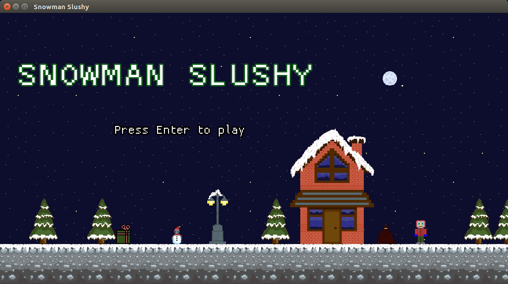
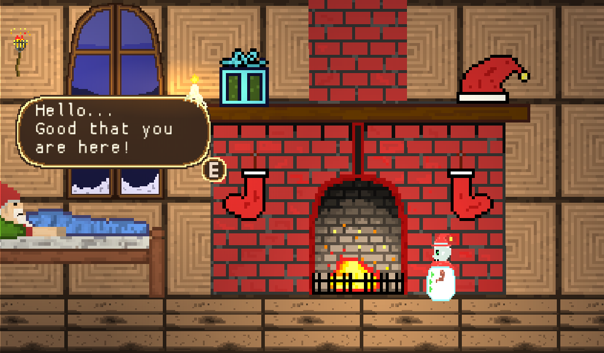

# Snowman Slushy
A game created as part of the [Godot Wild Jam 4](https://itch.io/jam/godot-wild-jam-4).

## Introduction
Santa's home in the North Pole has been attacked by the Grinch - and this time the Grinch was successful. It's a disaster.

You, an intrepid snowman, are the only one unharmed and the last hope of delivering happiness to children; the only one left that can save Christmas!

## Theme
Submited to Godot Wild Jam #4 with the main theme Delivery and the crossover themes: The 12 Levels of Christmas, Lose to Win, Surprise!, Change a World and Christmas Sucks.

## Playing the game
* Arrows: Move
* Space: Jump
*   (While on air) Space: Double Jump
*   ->You can deal damage to enemies by jumping in their heads.
* C: Dash
* E: Confirm

## Running the game
The game was built using the [Godot](https://godotengine.org/) - and can be ran locally by either
* From source (if you have a version of Gogot 3.1 installed locally) by downloading this repository, and opening it up in Godot and running the Main scene.
* 

## Contributors

## Credits

